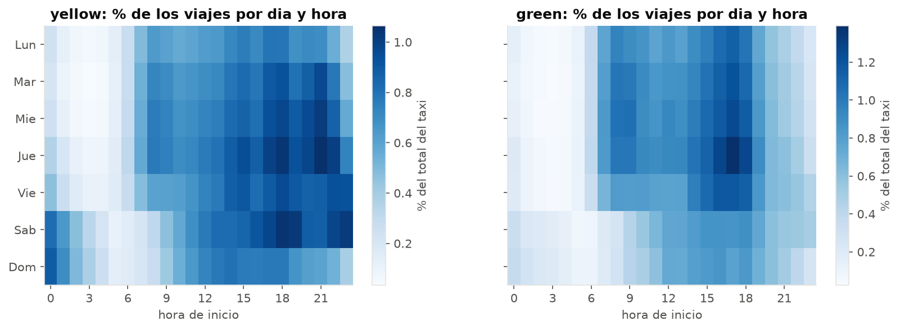
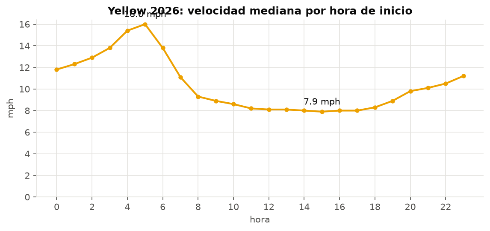
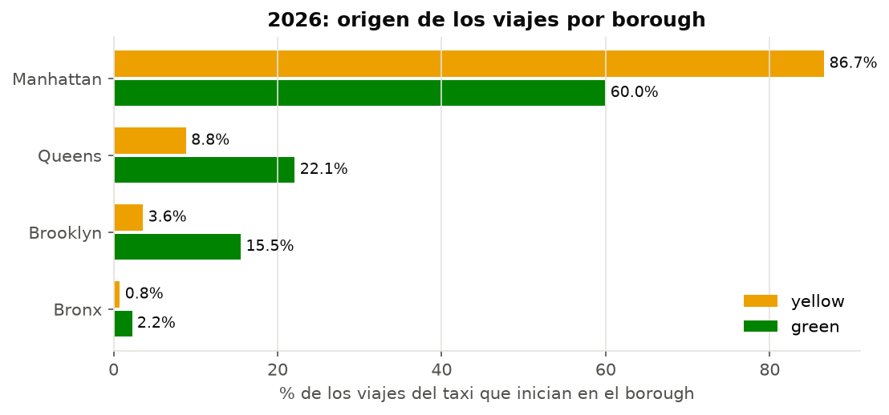
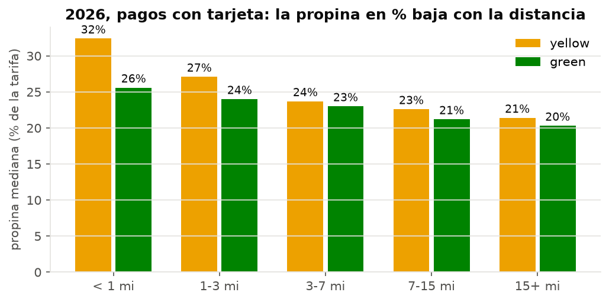
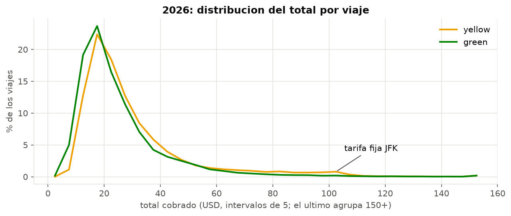

# Ejercicio 4 - Analisis exploratorio con DuckDB

Datos: **2026 (enero-agosto)**, vista `viajes_limpios` (reglas R1-R6 del
Ejercicio 3): 28,215,140 viajes yellow y 316,958 green.

```bash
docker compose exec lab python scripts/run_sql.py sql/04_*.sql --anios 2026 --csv docs/resultados/2026
```

Las graficas se generan en `notebooks/analisis_exploratorio.ipynb` y se guardan
en `docs/img/`. Los resultados completos de cada consulta estan en
`docs/resultados/2026/04_*.csv`.

## 4.1 Preguntas y por que se eligieron

Las preguntas salen de lo que el Ejercicio 3 mostro sobre los datos: hay
fechas y horas exactas (permiten estudiar el tiempo), distancia y duracion
(caracteristicas del viaje), zonas de origen y destino, dos tipos de taxi con
volumenes muy distintos, varias columnas de montos y una forma de pago que no
siempre se informa.

| # | Pregunta | Dimension pedida | Por que | Consulta |
|---|---|---|---|---|
| P1 | Como cambia la demanda mes a mes, y yellow y green siguen el mismo ritmo? | temporal | 8 meses de datos permiten ver estacionalidad | `04_01` |
| P2 | En que horas y dias se concentra la demanda de cada taxi? | temporal, yellow vs green | los timestamps son exactos; la demanda define la oferta necesaria | `04_02` |
| P3 | Como es un viaje tipico y que tan dispersas son distancia, duracion, velocidad y pasajeros? | caracteristicas, distribucion | las distribuciones son muy asimetricas (Ej. 3); el promedio puede enganar | `04_03` |
| P4 | Cuanto frena el trafico a los taxis segun la hora? | caracteristicas, temporal | velocidad = distancia / duracion, ambas disponibles | `04_04` |
| P5 | Donde operan yellow y green? Green cumple su funcion fuera de Manhattan? | yellow vs green | green existe para servir zonas que yellow no cubre | `04_05`, `04_06` |
| P6 | En que se diferencia un viaje yellow de uno green (tarifa, cargos, tipo de servicio)? | yellow vs green, pago | comparar por viaje y no por totales | `04_07` |
| P7 | Como pagan los pasajeros? | pago | 1 de cada 4 registros yellow no informa la forma de pago (Ej. 3) | `04_08` |
| P8 | Cuanta propina se deja y como cambia con la distancia? | pago, distribucion | la propina solo se registra con tarjeta | `04_09` |
| P9 | Como se distribuye el total cobrado? | distribucion | es la variable de ingreso principal | `04_10` |
| P10 | Que atipicos quedan despues de limpiar y son errores o viajes reales? | atipicos | la limpieza solo quito lo imposible; lo extremo pero posible sigue ahi | `04_11`, `04_12` |

## 4.2-4.4 Consultas, resultados e interpretacion

Cada archivo `sql/04_*.sql` empieza con un comentario que indica la pregunta,
la fuente y las decisiones. Todas consultan la vista `viajes_limpios`.

### P1. Demanda mensual - `04_01_viajes_por_mes.sql`

| mes | yellow, viajes/dia | green, viajes/dia |
|---|---:|---:|
| ene | 113,385 | 1,229 |
| feb | 114,591 | 1,254 |
| mar | 121,304 | 1,344 |
| abr | 122,394 | 1,386 |
| may | **126,123** | 1,366 |
| jun | 121,466 | 1,385 |
| jul | 107,870 | 1,244 |
| ago | **101,990** | 1,228 |

Se usa **viajes por dia** porque febrero tiene menos dias. Ambos taxis suben en
primavera (mayo es 11 % mayor que enero) y bajan en verano: agosto es el mes
mas bajo de yellow, 19 % por debajo de mayo. Es el patron esperado de una
ciudad con temporada turistica y laboral en primavera y vacaciones en verano.

### P2. Hora y dia de la semana - `04_02_hora_y_dia_semana.sql`



| dia | lun | mar | mie | jue | vie | sab | dom |
|---|---:|---:|---:|---:|---:|---:|---:|
| yellow, % de viajes | 11.9 | 13.6 | 14.5 | 15.8 | 15.0 | **16.0** | 13.3 |
| green, % de viajes | 14.2 | 15.1 | 15.7 | **16.5** | 15.0 | 12.1 | 11.4 |

(El periodo enero-agosto no tiene exactamente el mismo numero de cada dia de la
semana; la diferencia es de 1 dia como maximo y no cambia el orden.)

- **Yellow** tiene su pico entre las 17 y 19 h, pero tambien una vida nocturna
  clara: el sabado es el dia de mas viajes y la madrugada del sabado y domingo
  (0-2 h) concentra 4.0 % de los viajes, frente a 1.6 % en green.
- **Green** es un taxi de dia laboral: jueves es su dia mas fuerte y un dia de fin de
  semana tiene 23 % menos viajes que un dia laboral promedio. Su pico es a las 17 h (7.8 % de sus viajes en esa hora).

### P3. Caracteristicas del viaje - `04_03_caracteristicas_viaje.sql`

| | yellow | green |
|---|---:|---:|
| distancia mediana (mi) | 1.93 | 2.12 |
| distancia promedio (mi) | 3.51 | 3.30 |
| distancia p99 (mi) | 19.5 | 17.6 |
| duracion mediana (min) | 14.1 | 13.2 |
| velocidad mediana (mph) | 9.3 | 10.0 |
| pasajeros promedio | 1.25 | 1.30 |
| % con 1 pasajero | 82.3 | 82.8 |

El viaje tipico es corto: menos de 2 millas y unos 14 minutos. **El promedio
de distancia de yellow es 82 % mayor que la mediana**: unos pocos viajes largos
(aeropuertos) arrastran el promedio. Por eso se reportan medianas y
percentiles. Ocho de cada diez viajes llevan a una sola persona.

### P4. Velocidad segun la hora - `04_04_velocidad_por_hora.sql`



La velocidad mediana de yellow cae de **16.0 mph a las 5 h a 7.9 mph a las
15 h**. Una milla toma 3.7 minutos de madrugada y 7.6 minutos por la tarde: el
mismo trayecto dura el doble. Entre las 11 y las 18 h la velocidad se queda
plana en ~8 mph: no hay una "hora pico" puntual sino una meseta de congestion
todo el dia.

### P5. Donde operan - `04_05_zonas_por_borough.sql`, `04_06_zonas_top.sql`



- **Yellow**: 86.7 % de los viajes empieza en Manhattan. Sus zonas principales
  son Upper East Side, Midtown y **JFK Airport** (tercera zona, 4.0 %).
- **Green**: solo 60 % empieza en Manhattan, y casi todo es el norte de la isla:
  **East Harlem North y South suman el 40.6 % de todos los viajes green**.
  Queens (22.1 %) y Brooklyn (15.5 %) pesan 2.5 y 4.3 veces mas que en yellow.
- Los viajes green que empiezan en Queens terminan en Queens el 84 % de las
  veces; los yellow que empiezan en Queens, solo el 27 % (son viajes desde el
  aeropuerto hacia Manhattan).

### P6. Yellow vs green por viaje - `04_07_yellow_vs_green.sql`

| | yellow | green |
|---|---:|---:|
| tarifa mediana (USD) | 15.77 | 13.50 |
| total promedio (USD) | 30.25 | 25.35 |
| tarifa por milla (USD, viajes >= 1 mi) | 7.37 | 6.24 |
| recargo de congestion promedio | 2.26 | 0.92 |
| cargo CBD promedio | 0.54 | 0.06 |
| % viajes JFK / Newark (ratecode 2-3) | 2.63 | 0.25 |
| % tarifa negociada (ratecode 5) | 0.55 | 3.59 |
| % despacho (green, `trip_type = 2`) | - | 3.48 |

Un viaje green cuesta 5 USD menos en promedio. La diferencia no esta en la
tarifa por distancia sino en los **cargos por zona**: green casi no entra a la
zona de congestion de Manhattan (recargo 2.5 veces menor, cargo CBD 9 veces
menor) y casi no va a aeropuertos. Green usa tarifa negociada 6.5 veces mas.

### P7. Forma de pago - `04_08_metodos_pago.sql`

| forma de pago | yellow % | green % |
|---|---:|---:|
| tarjeta | 65.4 | 66.6 |
| sin detalle (Flex Fare) | **24.9** | 13.5 |
| efectivo | 9.1 | **19.7** |
| disputa / sin cargo | 0.6 | 0.3 |

La tarjeta domina en ambos. El efectivo es el doble de frecuente en green que
en yellow, coherente con barrios fuera del centro. Uno de cada cuatro viajes
yellow no dice como se pago.

### P8. Propinas - `04_09_propinas.sql`



Solo pagos con tarjeta. La propina mediana es 32 % de la tarifa en viajes de
menos de 1 milla y baja a 21 % en viajes de mas de 15 millas. En monto sube (de
2.47 a 13.20 USD), pero en proporcion baja: en un viaje corto, una propina
redonda de 2-3 USD es un porcentaje alto. Los viajes yellow de 7-15 millas
tienen el mayor % sin propina (22.6 %).

### P9. Distribucion del total - `04_10_distribucion_totales.sql`



La distribucion es asimetrica a la derecha: el 54 % de los viajes yellow paga
entre 15 y 30 USD. Aparece un **segundo pico pequeno entre 95 y 105 USD** en
yellow que no existe en green: es la tarifa fija entre JFK y Manhattan mas
recargos.

### P10. Atipicos - `04_11_atipicos_iqr.sql`, `04_12_aeropuertos.sql`

Con el criterio de Tukey (mayor que Q3 + 1.5 IQR), despues de limpiar quedan
como atipicos en yellow el 10.9 % de las distancias (> 8.25 mi), el 5.4 % de
las duraciones (> 42.7 min) y el 8.5 % de los totales (> 60 USD).

| yellow 2026 | % viajes | % ingresos | distancia mediana | total mediano | % total > 100 USD |
|---|---:|---:|---:|---:|---:|
| urbano | 91.8 | 79.0 | 1.77 mi | 22.49 | 0.3 |
| aeropuerto (EWR, JFK, LGA) | 8.2 | **21.1** | 11.49 mi | 78.46 | 18.5 |

La mayoria de esos "atipicos" **no son errores**: son viajes de aeropuerto, que
son largos y caros por naturaleza. El IQR sirve para encontrar valores raros,
pero no para decidir que borrar. Lo que si queda sospechoso es pequeno: 0.10 %
de viajes con propina mayor que la tarifa.

## 4.5 Hallazgos relevantes

1. **Un cuarto de los viajes yellow no informa como se pago.** En 2026 el
   24.9 % de los viajes limpios son registros "Flex Fare" (`payment_type = 0`,
   sin pasajeros ni ratecode); en green el mismo caso viene con `payment_type`
   nulo. Esos registros tienen totales normales pero propina casi nula (0.40
   USD), asi que cualquier analisis de pago o propina sobre todo el conjunto
   subestima la propina y la tarjeta. Las propinas solo son confiables en pagos
   con tarjeta.
2. **Green no es un taxi "de los otros boroughs": es un taxi del norte de
   Manhattan y de barrios.** 60 % de sus viajes empieza en Manhattan, y East
   Harlem concentra 40.6 %. Aun asi, su perfil es distinto del yellow: viajes
   que se quedan dentro del borough, el doble de efectivo, casi nada de
   aeropuertos ni de zona de congestion, y una demanda de dia laboral (23 % menos
   viajes por dia en fin de semana) frente a la vida nocturna y de sabado del yellow.
3. **Los aeropuertos son el 8 % de los viajes yellow pero el 21 % del dinero.**
   Explican el segundo pico de la distribucion del total (~100 USD, tarifa fija
   de JFK) y la mayoria de los atipicos por IQR. Tambien explican por que la
   distancia promedio (3.5 mi) casi duplica la mediana (1.9 mi).
4. **La congestion duplica el tiempo de un mismo viaje.** La velocidad mediana
   baja de 16 mph de madrugada a menos de 8 mph entre las 11 y las 18 h, una
   meseta de casi todo el dia y no un pico de hora punta.
5. **La propina en proporcion baja con la distancia** (32 % de la tarifa en
   viajes de menos de 1 milla, 21 % en los de mas de 15), aunque en dinero sube.
