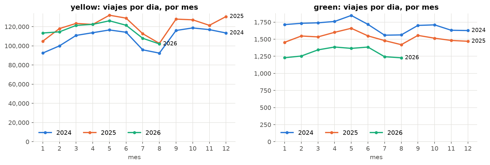
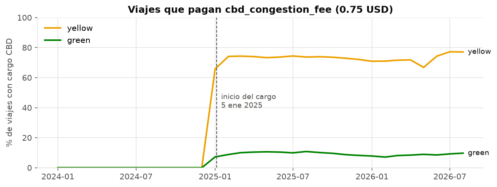
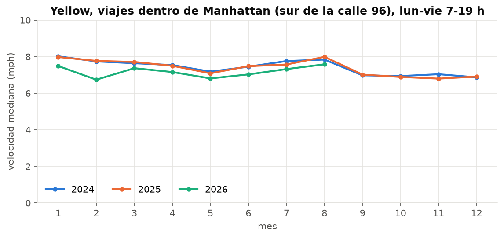
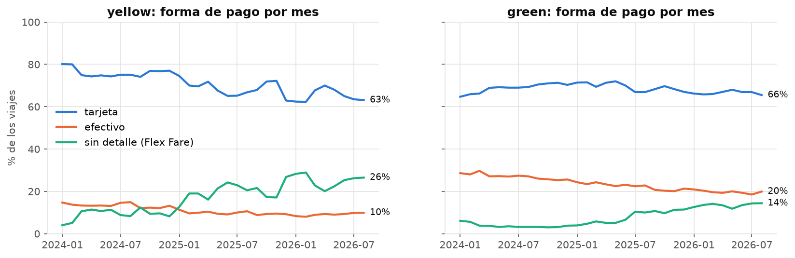
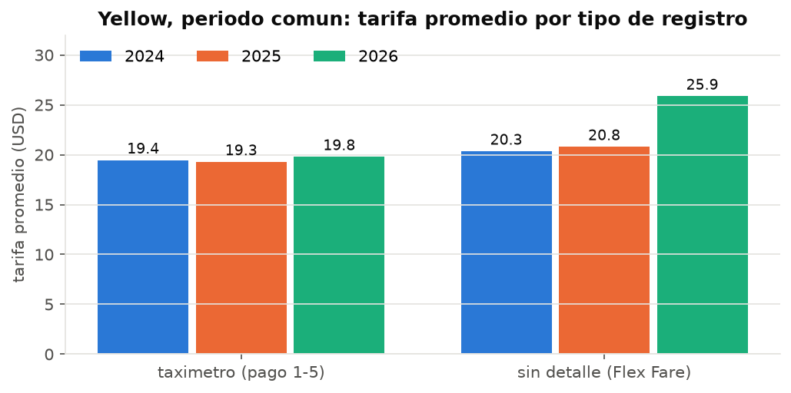

# Ejercicio 8 - Analisis con 2024, 2025 y 2026

Esta parte cubre 8.3 y 8.5-8.7. La descarga de 2025 (8.1, 8.2) y la
actualizacion del tablero (8.4) estan documentadas en sus propias secciones.

Datos: 64 archivos Parquet, **121,184,384 registros** (yellow 119.6 M, green
1.6 M). 2024 y 2025 completos; 2026 de enero a agosto.

```bash
# Ejercicios 3 y 4 otra vez, ahora sobre todos los anios (sin --anios)
docker compose exec lab python scripts/run_sql.py sql/03_*.sql sql/04_*.sql --csv docs/resultados/2024-2026
# Consultas propias del Ejercicio 8
docker compose exec lab python scripts/run_sql.py sql/08_*.sql --csv docs/resultados/2024-2026
```

## 8.3 Las consultas anteriores siguen funcionando

**No hubo que modificar ninguna consulta.** Los 27 archivos `sql/03_*.sql` y
`sql/04_*.sql` se ejecutaron sobre 2024-2026 tal cual estaban; lo unico que
cambia es que no se pasa `--anios 2026`. La seccion "8.3" del notebook los
recorre todos en un ciclo y registra filas y tiempo de cada uno.

Por que funcionan sin cambios:

- Las vistas leen `data/raw/<tipo>/*/*.parquet`: los archivos nuevos entran solos.
- `union_by_name = true` absorbe el cambio de esquema: `cbd_congestion_fee` no
  existe en los 12 archivos de 2024 y queda nula en esas filas en lugar de
  romper la consulta. `03_05_esquema_por_archivo.sql` ahora reporta esa columna
  (20 de 32 archivos) ademas de `request_source` (3 de 32).
- Ninguna consulta escribe un anio, un mes ni un nombre de archivo. Las que
  agrupan por tiempo usan `year(pickup)` o `anio_archivo`, que salen de los datos.
- Las reglas de limpieza son relativas a cada registro (R1 compara la fecha con
  el mes de *su* archivo), asi que valen para cualquier anio.

Tiempos con 4 veces mas datos (30 M -> 121 M filas):

| consulta | 2026 | 2024-2026 |
|---|---:|---:|
| `03_02_registros` | 0.01 s | 0.02 s |
| `03_07_resumen_columnas` (SUMMARIZE de 25 columnas) | 4.0 s | 15.5 s |
| `03_12_tarifas_negativas` (auto-join) | 0.7 s | 2.7 s |
| `03_13_duplicados` (GROUP BY de 10 columnas) | 0.9 s | 3.3 s |
| `04_03_caracteristicas_viaje` (percentiles) | 0.5 s | 2.1 s |

El tiempo crece de forma aproximadamente lineal con los datos. Las consultas que
solo leen metadatos (`03_01`, `03_03`, `03_05`) no cambian.

Al volver a correr el Ejercicio 3 con los tres anios aparecieron problemas que
2026 no mostraba: los 2.05 M de tarifas negativas en registros sin detalle de
enero a noviembre de 2025 (por eso la limpieza conserva solo 90.6 % de yellow
2025, frente a 95-96 % en los otros anios) y el proveedor 6 (Myle), que aparece
en green en 2025 con todos sus registros sin detalle y una tarifa que no
explica el total.

## 8.5 Evolucion de los indicadores

**Regla para comparar anios:** 2026 solo tiene enero-agosto. Comparar sus 8
meses contra 12 de 2024 haria parecer que todo cae. Las consultas `08_02`,
`08_03`, `08_07` y `08_08` calculan el **periodo comun** (los meses que existen
en todos los anios) a partir de los datos; hoy es enero-agosto, y cuando la TLC
publique septiembre de 2026 pasara a enero-septiembre sin tocar el SQL.

### Volumen - `08_01_volumen_mensual.sql`



### Indicadores por anio, enero-agosto - `08_02_comparacion_periodo_comun.sql`

| yellow | 2024 | 2025 | 2026 |
|---|---:|---:|---:|
| viajes | 25,487,194 | 28,678,171 (+12.5 %) | 28,215,140 (-1.6 %) |
| viajes por dia | 104,456 | 118,017 | 116,112 |
| distancia mediana (mi) | 1.80 | 1.87 | 1.93 |
| duracion mediana (min) | 12.7 | 13.0 | 14.1 |
| velocidad mediana (mph) | 9.5 | 9.7 | 9.3 |
| tarifa promedio (USD) | 19.53 | 19.58 | 21.30 |
| total promedio (USD) | 28.33 | 28.34 | 30.25 |
| % tarjeta | 75.9 | 68.7 | 65.4 |
| % efectivo | 13.8 | 10.0 | 9.1 |
| % sin detalle (Flex Fare) | 9.0 | 19.6 | 24.9 |
| propina mediana con tarjeta (% de la tarifa) | 25.9 | 26.6 | 26.4 |

| green | 2024 | 2025 | 2026 |
|---|---:|---:|---:|
| viajes | 415,732 | 371,830 (-10.6 %) | 316,958 (-14.8 %) |
| viajes por dia | 1,704 | 1,530 | 1,304 |
| distancia mediana (mi) | 1.96 | 2.02 | 2.13 |
| total promedio (USD) | 23.76 | 24.84 | 25.35 |
| % efectivo | 27.8 | 23.3 | 19.7 |
| % sin detalle | 4.0 | 6.4 | 13.5 |

### Composicion del total - `08_03_componentes_total.sql`

Promedio por viaje yellow, enero-agosto (USD):

| | 2024 | 2025 | 2026 |
|---|---:|---:|---:|
| tarifa | 19.53 | 19.58 | 21.30 |
| `congestion_surcharge` | 2.11 | 1.85 | 1.69 |
| `cbd_congestion_fee` | 0.00 | 0.55 | 0.54 |
| propina | 3.34 | 3.02 | 2.88 |
| total | 28.33 | 28.34 | 30.25 |

Advertencia del Ejercicio 3: la suma de componentes no es exacta (el proveedor 1
repite el recargo de congestion dentro de `extra`, y los registros sin detalle
no informan `congestion_surcharge`). La caida del promedio de
`congestion_surcharge` y de la propina viene, sobre todo, de que crecen los
registros que no informan esos campos, no de que se cobren menos.

## 8.6 Cambios y patrones visibles con los tres anios

### 1. El cargo por congestion de Manhattan aparece en enero de 2025 y no cambia la velocidad

`08_04_cargo_cbd_mensual.sql`, `08_05_velocidad_manhattan.sql`



- `cbd_congestion_fee` no existe en ningun archivo de 2024 y aparece en todos
  desde enero de 2025: el cobro empezo el 5 de enero de 2025 (diccionario de la
  TLC). En enero lo paga el 65.8 % de los viajes yellow (el mes empezo sin el
  cargo) y desde febrero ~74 %. Siempre vale 0.75 USD. En green solo lo paga
  ~10 %, coherente con que opera fuera de la zona.
- **No se ve un efecto en la velocidad de los taxis.** Para viajes yellow con
  origen y destino en Manhattan al sur de la calle 96, de lunes a viernes de 7
  a 19 h, la velocidad mediana de enero-agosto 2025 es practicamente igual a la
  de 2024 mes a mes (por ejemplo, 7.98 vs 8.01 mph en enero, 7.71 vs 7.65 en
  marzo), y en 2026 es menor (6.74 mph en febrero). La zona usada es mas grande
  que la del cargo (al sur de la calle 60) y la comparacion es descriptiva: el
  clima, las obras o el volumen de viajes tambien influyen.



### 2. Crecen los registros sin detalle, y explican la subida de la tarifa

`08_06_pagos_mensual.sql`, `08_08_tarifa_por_tipo_registro.sql`, `03_11_pago_sin_detalle_por_mes.sql`



- Los registros "Flex Fare" (sin forma de pago, pasajeros ni ratecode) pasan de
  **4 % de yellow en enero 2024 a 28 % en enero 2026**. En green pasan de 3-6 %
  a 14 %; ahi el salto coincide con la entrada del proveedor 6 (Myle) en 2025,
  cuyos registros son todos de este tipo.
- La tarjeta pierde 10 puntos y el efectivo baja de forma sostenida (yellow
  13.8 % -> 9.1 %; green 27.8 % -> 19.7 %).
- **La tarifa promedio yellow sube 9 % en 2026 (19.58 -> 21.30 USD), pero no
  por el taximetro:**

  

  | yellow, ene-ago | 2024 | 2025 | 2026 |
  |---|---:|---:|---:|
  | taximetro (pago 1-5): tarifa promedio | 19.45 | 19.28 | 19.79 |
  | sin detalle: tarifa promedio | 20.34 | 20.79 | **25.86** |
  | sin detalle: % de los viajes | 9.0 | 19.6 | 24.9 |

  La tarifa de los viajes con taximetro solo sube 2.6 %. El aumento viene de
  los registros sin detalle, que son mas largos (2.9 mi de mediana frente a 1.7)
  y en 2026 se cobran mas caro por milla (8.10 USD frente a 7.08), y que ademas
  son cada vez mas. Es un efecto de **composicion**, no un aumento general de
  precios: si no se separan los tipos de registro, la conclusion seria
  equivocada.

### 3. Los taxis verdes pierden casi una cuarta parte de sus viajes en dos anios

`08_01_volumen_mensual.sql`, `08_02_comparacion_periodo_comun.sql`

- Green cae **-10.6 % en 2025 y -14.8 % en 2026** (enero-agosto): -23.8 % en
  dos anios. Todos los
  meses de 2025 y 2026 estan por debajo del mismo mes del anio anterior (entre
  -5 % y -19 %). De 1,704 viajes por dia en 2024 pasa a 1,304 en 2026 (-23 %).
- Yellow, en cambio, crece **+12.5 % en 2025** y se estabiliza en 2026 (-1.6 %).
- La participacion de green en el total de viajes de taxi baja de ~1.6 % a ~1.1 %.

### 4. Pierden peso los viajes al aeropuerto

`08_07_aeropuertos_por_anio.sql`

| yellow, ene-ago | 2024 | 2025 | 2026 |
|---|---:|---:|---:|
| % de viajes de/hacia EWR, JFK, LGA | 10.16 | 8.90 | 8.17 |
| % de los ingresos | 28.04 | 24.58 | 21.05 |
| total mediano de un viaje JFK (USD) | 89.11 | 89.48 | 88.98 |

El precio de un viaje a JFK no cambia, pero los aeropuertos pesan cada vez
menos: el crecimiento de 2025 fue de viajes urbanos.

### 5. El viaje tipico se alarga

Entre 2024 y 2026 la distancia mediana pasa de 1.80 a 1.93 millas en yellow
(+7 %) y de 1.96 a 2.13 en green (+9 %), y la duracion mediana de 12.7 a 14.1
minutos en yellow. La velocidad no mejora: los viajes son algo mas largos y
tardan proporcionalmente mas.

## 8.7 Consultas utilizadas

| archivo | uso |
|---|---|
| `sql/03_*.sql`, `sql/04_*.sql` | re-ejecutadas sin cambios sobre 2024-2026 (8.3) |
| `08_01_volumen_mensual.sql` | viajes por mes, viajes por dia y variacion frente al mismo mes del anio anterior |
| `08_02_comparacion_periodo_comun.sql` | indicadores por anio en el periodo comun |
| `08_03_componentes_total.sql` | promedio de cada componente del total por anio |
| `08_04_cargo_cbd_mensual.sql` | % de viajes con cargo CBD y su valor, por mes |
| `08_05_velocidad_manhattan.sql` | velocidad mediana dentro de Manhattan en dias laborales, por mes |
| `08_06_pagos_mensual.sql` | mezcla de formas de pago por mes |
| `08_07_aeropuertos_por_anio.sql` | peso de los aeropuertos en viajes e ingresos |
| `08_08_tarifa_por_tipo_registro.sql` | tarifa por anio separando taximetro y registros sin detalle |

Cada archivo empieza con un comentario que indica la pregunta, la fuente y las
decisiones tomadas. Resultados en `docs/resultados/2024-2026/08_*.csv`.
