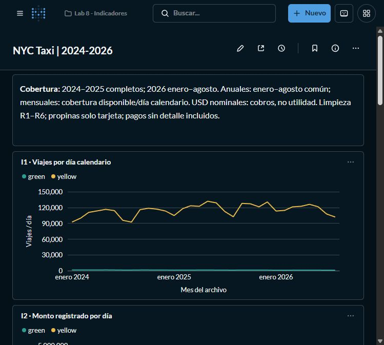

# Ejercicios 7.4–7.5 y 8.4 — Tablero Metabase

El tablero [**NYC Taxi | 2024-2026**](http://localhost:3000/dashboard/2-nyc-taxi-2024-2026), dentro de la colección **Lab 8 - Indicadores**, presenta los ocho indicadores del [ejercicio 7](ej7-indicadores.md) con Yellow y Green y los tres años. Se verificó en la interfaz que las ocho preguntas cargan y que el tablero quedó guardado. La definición reproducible de las preguntas, textos SQL, visualizaciones y disposición está en [metabase/dashboard-spec.json](metabase/dashboard-spec.json). Las instrucciones para crear o actualizar esa colección en otra instalación están en [metabase/README.md](metabase/README.md).

En esta instalación, la colección tiene ID 5, la conexión DuckDB ID 2, el tablero ID 2 y las preguntas IDs 40–47. El registro [metabase/installation.json](metabase/installation.json) conserva esos identificadores y el acceso local sin credenciales. La URL requiere que Docker y Metabase estén funcionando en esta computadora; los IDs pueden cambiar al reproducirlo en otro equipo.

## Qué se actualizó para 8.4

La incorporación de 2025 y la consulta conjunta con 2024 y 2026 se resuelven en la fuente de datos, sin escribir fechas fijas en las ocho consultas `sql/07_*.sql`. La base persistente `data/processed/taxi.duckdb` materializa los registros originales y expone `viajes`, `viajes_limpios` y `zonas`, con los mismos nombres y columnas que las vistas sobre Parquet. Metabase accede a `/workspace/data/processed/taxi.duckdb` en modo de solo lectura. Las preguntas ejecutan `SELECT`; no crean vistas ni importan archivos desde la interfaz.

Se muestran dos alcances temporales:

- **Series mensuales I1, I2, I5 e I8:** enero–diciembre de 2024 y 2025 y enero–agosto de 2026. Son 32 meses disponibles por taxi, 64 combinaciones taxi/mes. Los cuatro meses restantes de 2026 no se rellenan como cero.
- **Comparaciones anuales I3, I4, I6 e I7:** solo los meses presentes en todas las combinaciones taxi/año, actualmente enero–agosto. Cada SQL deriva esa intersección desde la cobertura de `viajes`, incluye `meses_comunes` en el resultado y mantiene la regla cuando se incorporan archivos nuevos.

La nota inicial del tablero identifica esa cobertura, las reglas R1–R6, los USD nominales y la ausencia de propinas en efectivo. La actualización utiliza los mismos indicadores para los tres años: no compara totales anuales incompletos con completos. El manifiesto [resultados/indicadores/manifest.json](resultados/indicadores/manifest.json) registra la cobertura que se verificó desde los datos y los hashes del SQL ejecutado.

## Disposición y lectura

| Pregunta guardada | Visualización | Comparación disponible |
|---|---|---|
| I1 · Viajes por día calendario | Línea mensual por taxi | Volumen ajustado por duración del mes; incluye variación interanual en el resultado SQL. |
| I2 · Monto registrado por día | Línea mensual por taxi | USD nominales/día; total registrado, no utilidad del conductor. |
| I3 · Ticket promedio en meses comunes | Barras por año y taxi | Promedio de `total_amount`, ponderado por viajes. |
| I4 · Duración del viaje típico | Barras por año y taxi | Mediana aproximada de minutos; distancia y velocidad también están en el resultado SQL. |
| I5 · Mezcla mensual de métodos de pago | Tabla | Porcentaje por taxi/mes/categoría, incluyendo NULL/0. |
| I6 · Propina con tarjeta sobre tarifa | Barras por año y taxi | Mediana aproximada de propina como porcentaje de `fare_amount`, solo tarjeta. |
| I7 · Cinco zonas principales de recogida | Tabla | Top cinco por taxi/año y porcentaje sobre todos sus viajes. |
| I8 · Registros conservados tras limpieza | Línea mensual por taxi | Porcentaje de originales conservados; escala 0–100. |

La especificación portable organiza las seis gráficas y dos tablas en cuatro filas con dos columnas, precedidas por la nota de cobertura, para una ventana de escritorio amplia. En la ventana estrecha de las capturas, Metabase apila las tarjetas en una columna para permitir su lectura. I5 usa tabla porque ambos taxis tienen denominadores propios: apilar directamente sus porcentajes los mezclaría. I7 muestra el ranking completo de cada combinación taxi/año; truncar a las primeras cinco filas de toda la consulta ocultaría los otros grupos.

Yellow tiene un volumen muy superior a Green. En I1 e I2, revisar también cada serie por separado con la leyenda o abrir la pregunta para inspeccionar su tabla. El ticket, la duración, las propinas y la retención permiten comparar ambos taxis en unidades de magnitud semejante.

## Reproducir en una instalación nueva

```bash
# Descargar los datos y las zonas primero. Detener Metabase antes de escribir
# taxi.duckdb; esperar a que la materializacion termine antes de iniciarlo:
docker compose stop metabase
docker compose exec -T lab python scripts/materialize.py
docker compose start metabase

# Reproducir los resultados en memoria desde Parquet:
docker compose exec -T lab python scripts/export_indicators.py

# Revisar la especificacion sin autenticar ni consultar la base:
docker compose exec -T lab python scripts/publish_metabase.py --dry-run

# Crear o actualizar las preguntas y el tablero (entrada interactiva de cuenta):
# Esperar primero a que Metabase local responda tras el arranque.
docker compose exec lab python scripts/publish_metabase.py --url http://metabase:3000
```

El último comando requiere la cuenta de administrador local ya creada; pide el correo y la contraseña sin guardarla en los archivos. La especificación portable no contiene credenciales ni IDs. La cuenta y el tablero de una computadora se guardan en el volumen `metabase-data`; no se distribuyen al clonar Git. El script busca la colección, conexión, preguntas y tablero por nombres exactos y puede volver a ejecutarse para actualizarlos; los IDs resultantes dependen de cada instalación.

Cuando llegan meses nuevos, descargar, detener Metabase y cerrar otras conexiones al archivo antes de materializar, iniciar Metabase de nuevo, regenerar indicadores y volver a publicar. Eso sincroniza la cobertura escrita en la nota con los datos que realmente contiene la base. No hace falta editar las ocho consultas SQL. El JSON portable y los CSV se versionan; los Parquet y la base `.duckdb` se mantienen fuera de Git.

## Evidencia disponible

- [Tablero local verificado](http://localhost:3000/dashboard/2-nyc-taxi-2024-2026) y [registro de la instalación](metabase/installation.json): ocho preguntas guardadas y visualizadas, seis gráficas y dos tablas.
- Capturas del tablero guardado: [01 — cobertura e I1](img/07_tablero_01.jpg), [02 — I2 e I3](img/07_tablero_02.jpg), [03 — I4 e I5](img/07_tablero_03.jpg), [04 — I6 e I7](img/07_tablero_04.jpg) y [05 — I7 e I8](img/07_tablero_05.jpg).
- [dashboard-spec.json](metabase/dashboard-spec.json): definición portable con ocho preguntas SQL, seis gráficas, dos tablas, posiciones y nota de cobertura.
- [CSV y manifiesto de indicadores](resultados/indicadores): ejecución real de las ocho consultas desde Parquet sobre 2024–2026. I1/I2/I8 producen 64 filas; I3/I4/I6, seis; I5, 338; I7, 30.
- [reproduction-check.json](metabase/reproduction-check.json): comprobación de la reproducción mediante API en una instancia aislada, con los ocho SQL completados y los mismos IDs tras dos publicaciones. No utilizó la cuenta ni el volumen de la instalación principal; el contenedor temporal se eliminó al terminar.
- [clean-check.json](metabase/clean-check.json): clon local limpio del código, exportación completa y validaciones aprobadas con los datos existentes montados en solo lectura. Esta comprobación reutilizó la descarga local; no realizó una descarga nueva.
- [Documentación del publicador](metabase/README.md): comandos de reproducción, comportamiento al repetirlos y API utilizada.



La especificación portable permite reconstruir la entrega en otro equipo; las cinco capturas verifican su representación en la instancia local. Los CSV permiten revisar los resultados completos, aunque el tablero muestre solo una métrica de una pregunta o las primeras filas de una tabla. Las medianas de las capturas pueden diferir ligeramente de las de los CSV porque `approx_quantile` calcula estimaciones y Metabase ejecuta las consultas en un contexto distinto; las poblaciones, los filtros y las definiciones SQL son los mismos.
